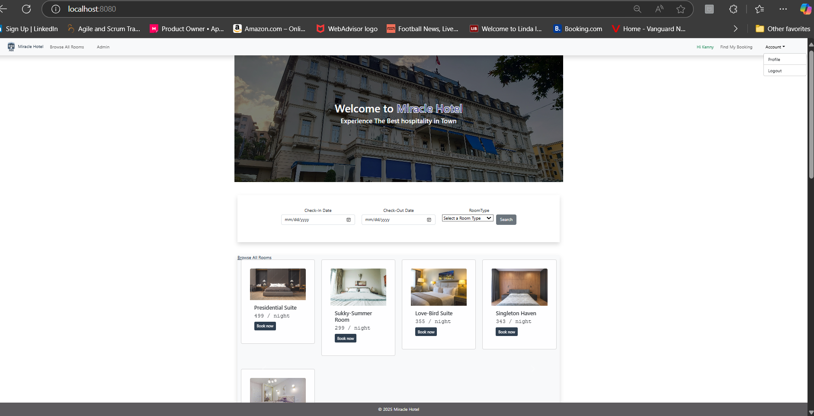
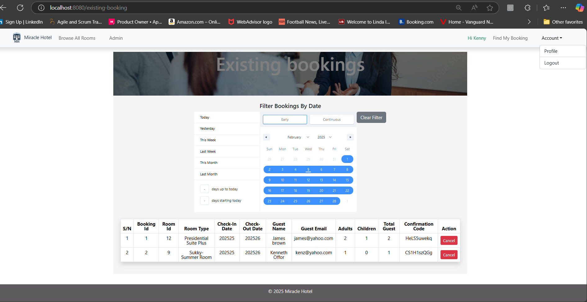
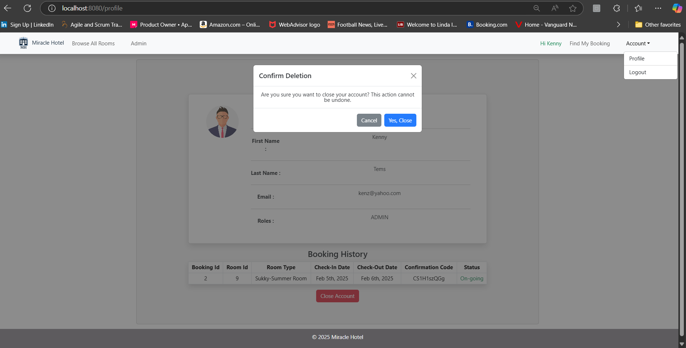
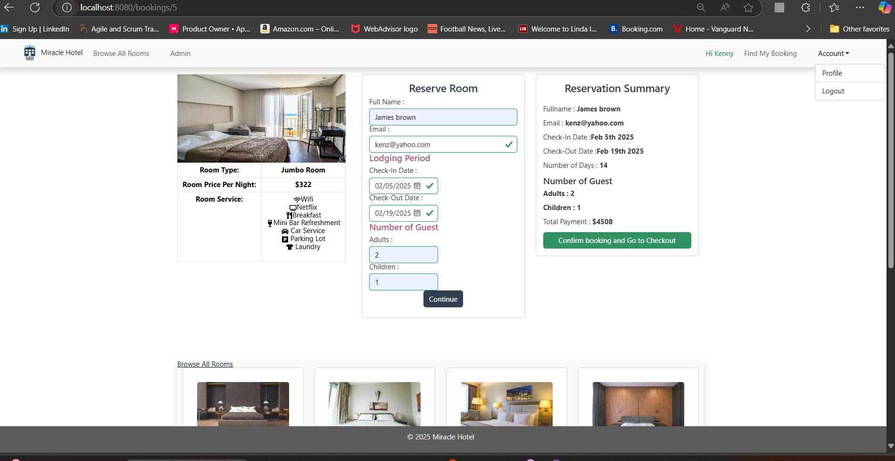

# 

This project was generated with [React + Vite](https://github.com/vitejs/vite-plugin-react/blob/main/packages/plugin-react/README.md) and [Spring Boot](https://start.spring.io) framework

## Description
**Miracle Hotel Software** is a comprehensive application designed to streamline hotel operations and provide online services. It includes managing reservations, check-ins/check-outs, room booking, billing, and personalized guest profile accounts. The system acts as a centralized platform to optimize efficiency and enhance the guest experience, ultimately driving customer satisfaction.

Guests can book rooms online, track room availability, find a suitable room, and manage room rates using the flexible features and channels provided by the system.

The software facilitates faster check-in/check-out processes, efficiently responds to guest requests, generates invoices, processes payments, and manages account balances.

Also, the system is fully secured with Spring Security, RBAC (Role Based Authentication Control) and JWT authentication mechanism.

## Technology Stacks
- Java `JDK 17`
- React `v18.3.1`
- Vite `v5.4.1`
- Spring Boot `v3.3.6`
- MySql
- JWT Authentication
- JavaScript
- Nginx server
- HTML
- Boostrap
- CSS
- NodeJS
- Docker
- Kubenetes
- AWS EKS
- AWS EC2

## Components
### HomepageComponent
This is the landing page of the system where guest can view/check room availability

Guest needs to login before making reservation

### Managed Booking Room Component (Tracking All Rooms Availability)
This is where an admin user can use the booking filter mechanism to track all rooms availability by dates

### Guest Profile Account Component
Guests can create account, login and personalize their Profile. Real time information about guest Booking history is updated by the system in the account.    

### Booking RoomComponent
This is where guest can make reservations for rooms and checkout their orders for billing.    

## Getting Started
### Local environment set-up
- Copy The frontend service repo from github `https://github.com/Keoffor/miracle-hotel-frontend.git`
- Cd into the project folder - miracle-hotel-frontend
- Run `npm install` to install all dependencies.
- Run `npm dev run` to start project and go to  `http://localhost:8080/`. to lanuch the app in your browser.

# Miracle Hotel Backend Service

## Overview

Miracle Hotel backend Service is responsible for the CRUD operations and handling of all requests from client (frontend). When users interact with the client app, the backend service returns response based on the input.

## Getting Started

1. Clone repo from `https://github.com/Keoffor/miracle-hotel-service.git`

2. Open in IDE of your choice to launch the service in port 8080